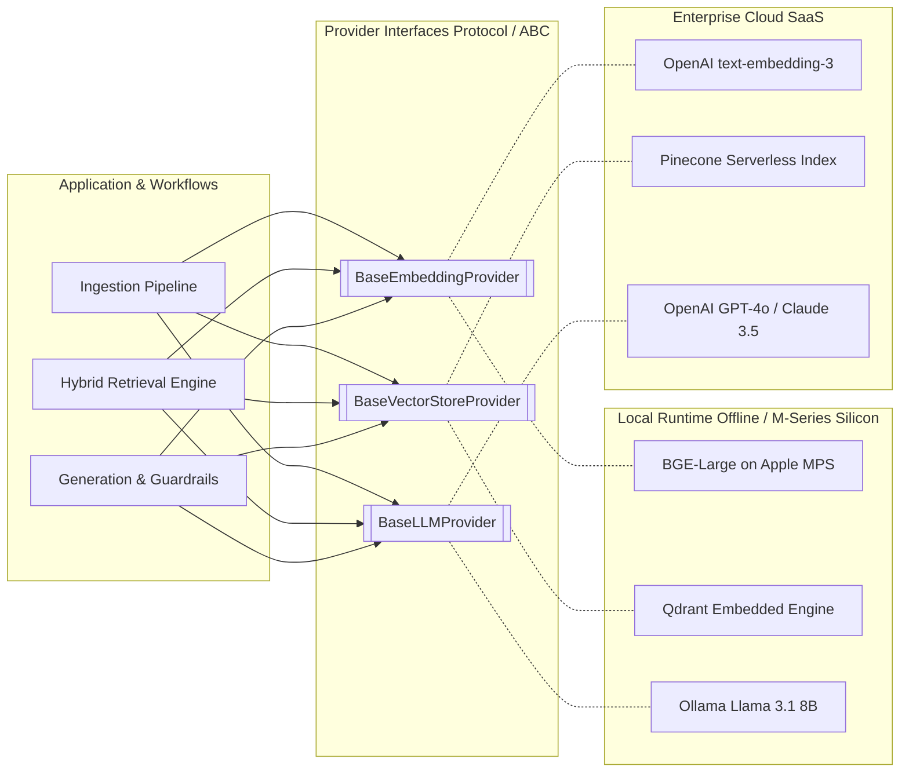
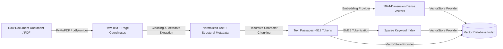
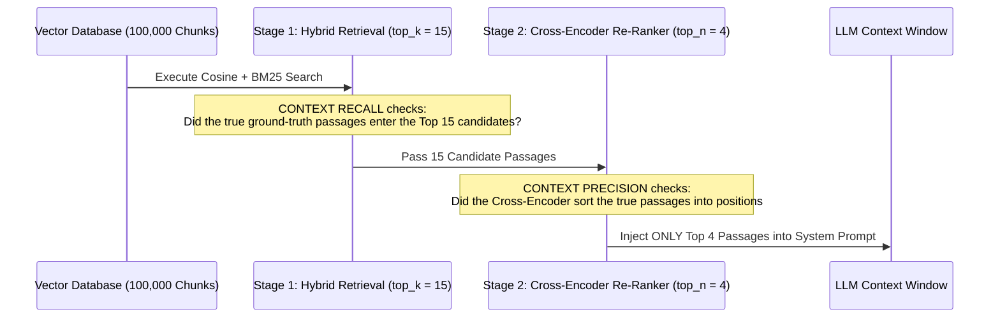

# AI Engineering Interview & Architecture Reference Guide: Invariable Docs
*A self-contained technical reference on enterprise Retrieval-Augmented Generation (RAG), Hybrid Retrieval, Cross-Encoder Re-Ranking, and System Evaluation.*

---

## 1. Architectural Philosophy: Provider Abstraction (`Strategy Pattern`)

### The Core Architectural Decision
In enterprise AI engineering, direct coupling to specific model APIs or database vendors (`e.g., hard-coding OpenAI SDK calls or specific Qdrant drivers inside core application workflows`) creates vendor lock-in and impedes offline development. Modern system architectures enforce strict separation of concerns via abstract provider protocols (`Strategy Pattern`).



* **Engineering Impact:** All pipelines interact exclusively with `BaseEmbeddingProvider`, `BaseVectorStoreProvider`, and `BaseLLMProvider`. Migrating a deployment from a local Apple Silicon development environment (`Ollama + Local Qdrant + BGE-Large via MPS`) to a cloud-native production deployment (`OpenAI + Pinecone Serverless`) requires zero modifications to business logic or pipeline code; the underlying implementation is injected dynamically at initialization via environment settings.

---

## 2. Ingestion & Indexing Pipeline Architecture

The ingestion pipeline transforms raw unstructured documents into structured, multi-modal vector representations optimized for both semantic and exact-match retrieval.



### Stage-by-Stage Data Transformation

To illustrate the exact data mutations across the pipeline, consider an enterprise financial document (`apple_10k_2023.pdf`, Page 42):

> *"Total R&D expenses in fiscal year 2023 were $29.9 billion, compared to $26.3 billion in 2022. This increase was primarily driven by headcount growth and silicon investments."*

| Stage | Processing Engine | Output State & Structure |
| :--- | :--- | :--- |
| **Stage 1: Document Parsing** | `PyMuPDF` / `pdfplumber` | Extracts raw character sequences alongside document boundaries (`page_no = 42`). Preserves table layouts when present. |
| **Stage 2: Normalization & Metadata** | Structural Cleaner | Normalizes whitespace and attaches domain metadata (`doc_id="apple_10k_2023.pdf"`, `page_no=42`, `section_header="Item 7. Management's Discussion"`). |
| **Stage 3: Chunking** | Recursive Character Splitter | Splits normalized text at semantic boundaries (`paragraphs`, `sentences`) into bounded tokens (`chunk_size = 512`, `overlap = 64`). Outputs discrete passage strings. |
| **Stage 4a: Dense Embedding** | `BaseEmbeddingProvider` (`BAAI/bge-large-en-v1.5`) | Projects passage strings into a continuous semantic vector space: `[0.12, -0.04, 0.88, 0.01, -0.32, ...]` ($1,024 \text{ dimensions}$). |
| **Stage 4b: Sparse Indexing** | `rank_bm25` Tokenizer | Generates a sparse keyword-frequency map weighted by inverse document frequency: `{ "R&D": 3.2, "expenses": 1.1, "2023": 2.4, "$29.9": 4.8 }`. |
| **Stage 5: Storage Injection** | `BaseVectorStoreProvider` (`Qdrant`) | Persists all three layers (`Dense Vector`, `Sparse Vector`, and `Original Text + Metadata Payload`) as a unified point in the index. |

---

## 3. Anatomy of a Vector Database Record (`Payload Separation`)

### Technical Requirement
A common design oversight is storing only numeric vector representations ($1,024 \text{ float arrays}$) in the database index. While high-dimensional vectors allow distance-based similarity search (`Cosine`, `Euclidean`), **vectors cannot be reversed back into natural language by a Language Model during generation.** 

To enable end-to-end RAG, vector databases (`Qdrant`, `Pinecone`, `Chroma`) structure every stored point (`Record`) into three decoupled components:

```json
{
  "point_id": "chunk_0042",
  
  "dense_vector": [0.12, -0.04, 0.88, 0.01, -0.32, 0.19], 
  "sparse_vector": { "indices": [104, 882], "values": [3.2, 4.8] },
  
  "payload": {
    "text": "Total R&D expenses in fiscal year 2023 were $29.9 billion, compared to $26.3 billion in 2022...",
    "metadata": {
      "doc_id": "apple_10k_2023.pdf",
      "page_no": 42,
      "section_header": "Item 7. Management's Discussion"
    }
  }
}
```

* **Index Layer (`dense_vector`, `sparse_vector`)**: Evaluated **exclusively inside the vector search engine** using mathematical distance metrics during queries. The LLM never reads these numeric arrays.
* **Payload Layer (`payload.text`, `payload.metadata`)**: Retrieved by the backend application *after* vector scoring concludes. The `payload.text` string is injected directly into the prompt context window (`<context>...</context>`), and `payload.metadata` is utilized for strict source attribution (`[Source: apple_10k_2023.pdf, p. 42]`).

---

## 4. Hybrid Retrieval & Reciprocal Rank Fusion (`RRF`)

In complex enterprise domains (`Financial Filings`, `Legal Contracts`, `Technical Documentation`), neither dense semantic retrieval nor sparse keyword matching alone achieves production-grade recall.

| Search Methodology | Underlying Mechanism | Primary Strengths | Technical Limitations |
| :--- | :--- | :--- | :--- |
| **Dense Retrieval (Embeddings)** | Cosine similarity across normalized $d$-dimensional latent vectors. | **Semantic Generalization:** Matches conceptual intent even with varied phrasing (`"revenue expansion"` $\rightarrow$ `"sales growth"`). | **Exact-Match Blindness:** Frequently misses exact entity codes (`"Section 14(a)"`), rare acronyms, or precise numeric figures (`"$29.9 billion"`). |
| **Sparse Retrieval (BM25)** | Term frequency saturation ($k_1$) and length-normalized ($b$) word overlap. | **Exact-Match Precision:** Delivers near-perfect recall when queries contain specific identifiers, codes, or exact figures. | **Vocabulary Mismatch:** Fails when queries use synonyms or abstract terminology (`"automobile"` $\rightarrow$ `"car"` yields zero similarity). |
| **Hybrid Retrieval (`RRF`)** | Reciprocal Rank Fusion: <br> $Score = \sum \frac{1}{k + \text{rank}_i} \times W_i$ | **Full Coverage:** Combines dense conceptual reach with exact keyword accuracy ($W_{\text{dense}}=0.7, W_{\text{sparse}}=0.3, k=60$). | Requires maintaining two parallel index structures and introduces slight latency during candidate merging. |

---

## 5. Evaluation & Diagnostics: Context Recall vs. Context Precision

In two-stage RAG architectures (`Stage 1: Top-K Hybrid Retrieval` $\rightarrow$ `Stage 2: Top-N Cross-Encoder Re-Ranking`), diagnosing system failures requires distinguishing between retrieval misses (`Stage 1`) and re-ranking misclassifications (`Stage 2`).



### Comparative Metric Breakdown (`RAGAS Framework`)

| Evaluation Metric | Architectural Stage Tested | Score Target & Definition | Root Cause of Low Scores (`Score < 0.70`) | Actionable Engineering Remedies |
| :--- | :--- | :--- | :--- | :--- |
| **Context Recall** | **Stage 1: Candidate Retrieval** (`top_k = 15`) | **Target: $> 0.70$**<br>Measures whether all ground-truth evidence necessary to answer the prompt was successfully retrieved from the global index into the candidate pool. | **Retrieval Miss:**<br>The required information **exists in the vector database**, but the embedding model or BM25 index failed to surface it within the top $K$ candidate passages. | 1. Implement Query Transformations (`Multi-Query`, `HyDE`).<br>2. Calibrate chunking boundaries (`chunk_size = 512`, `overlap = 64`).<br>3. Adjust BM25 hyperparameters ($k_1$, $b$) or increase candidate depth (`top_k = 25`). |
| **Context Precision** | **Stage 2: Cross-Encoder Re-Ranking** (`top_n = 4`) | **Target: $> 0.75$**<br>Measures whether true ground-truth passages within the retrieved candidate pool are ranked above irrelevant noise passages. | **Re-Ranker Misclassification:**<br>The ground-truth passages **were successfully retrieved into the Top 15** (`Recall = 100%`), but the Cross-Encoder scored them poorly, pushing them down to positions `#12, #13, #14` while passing noise (`#1-#4`) to the LLM. | 1. Upgrade the Cross-Encoder model (`BAAI/bge-reranker-v2-m3` or `Cohere Rerank v3.5`).<br>2. Increase LLM context allowance (`top_n = 6`).<br>3. Fine-tune the re-ranker on domain-specific `(query, passage)` pairs. |

---

## 6. Core Architecture Q&A Reference

#### Q1: Why use a two-stage retrieval pipeline (`Bi-Encoder Top-15` $\rightarrow$ `Cross-Encoder Top-4`) rather than scoring all database chunks with a Cross-Encoder directly?
> **Engineering Rationale:** **Computational Complexity and Latency.**  
> * **Bi-Encoders (`Embeddings`)** project queries and documents independently into vector space ($O(1)$ real-time similarity via pre-computed HNSW graph indexes).  
> * **Cross-Encoders (`Re-Rankers`)** process the concatenated sequence `[CLS] Query [SEP] Document [SEP]` through every self-attention layer of a Transformer network simultaneously ($O(N)$ real-time compute per candidate).  
> Running a full Cross-Encoder across 100,000 documents at query time introduces prohibitive latency (minutes) and massive compute costs. The industry standard is filtering 100,000 down to `15` candidate chunks using fast Bi-Encoder/BM25 indexes (`Stage 1`), then utilizing the high-precision Cross-Encoder to evaluate and sort only those `15` candidates (`Stage 2`).

#### Q2: What is the impact of chunk size on RAG performance, and how do you mitigate boundary issues?
> **Engineering Rationale:**  
> * **Sub-optimal Chunk Size (`< 128 tokens`)**: Introduces context fragmentation. Passages lose anaphora resolution and surrounding context (`e.g., "The agreement was signed on Tuesday"` — who signed what?).  
> * **Excessive Chunk Size (`> 2,048 tokens`)**: Introduces semantic noise during embedding (vectors become diluted averages across multiple topics) and triggers the **"Lost in the Middle"** LLM decoding failure mode, where attention heads degrade on facts buried midway through long context windows.  
> * **Mitigation**: Deploy **Recursive Character Splitting** at `512` tokens with `10-25% overlap` (`64 tokens`) to maintain semantic continuity across chunk boundaries, or implement **Semantic Chunking** (`splitting at cosine distance inflection points between consecutive sentences`).

#### Q3: How do you enforce strict anti-hallucination guarantees when user queries fall outside the document corpus?
> **Engineering Rationale:** **Dual-Layer Guardrails (Re-Ranker Thresholding $+$ Prompt Constraints).**  
> 1. **Early Interception (`Cross-Encoder Thresholding`)**: We configure a minimum relevance threshold (`rerank_score_threshold = 0.25`). If the highest-scoring candidate passage after Cross-Encoder re-ranking falls below `0.25`, the application intercepts the workflow and returns: *"The provided documents do not contain information about this topic,"* **completely bypassing the LLM API call** (saving token budget and eliminating generation risk).  
> 2. **Context-Bounded Prompting**: Passages are injected inside strict XML tags (`<context><chunk id="1">...</chunk></context>`). The system prompt mandates: *"Answer exclusively using facts entailed directly by the provided `<context>`. If the context is insufficient, state explicitly that the documents lack the information. Do NOT extrapolate or assume."* Every assertion must include `[Source: doc_id, p. X]`.

#### Q4: How is RAG evaluation automated within CI/CD pipelines to prevent quality regressions?
> **Engineering Rationale:**  
> We maintain a versioned **Golden Dataset** (`35-50 ground-truth triples of question, ideal_answer, and verified_context_passages`) in the repository. We integrate the **RAGAS Evaluation Harness** into pre-merge GitHub Actions workflows (`invariable_docs.eval.regression_runner`).  
> On any pull request modifying chunk parameters, embedding providers, or system prompts, the CI runner executes the golden suite and calculates **Faithfulness (`>0.85`)**, **Answer Relevancy (`>0.80`)**, **Context Precision (`>0.75`)**, and **Context Recall (`>0.70`)**. If any metric regresses below the configured gate thresholds, the pull request merge is programmatically blocked.
