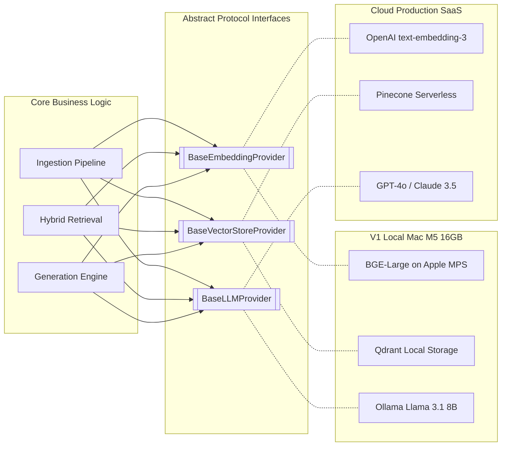
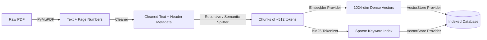
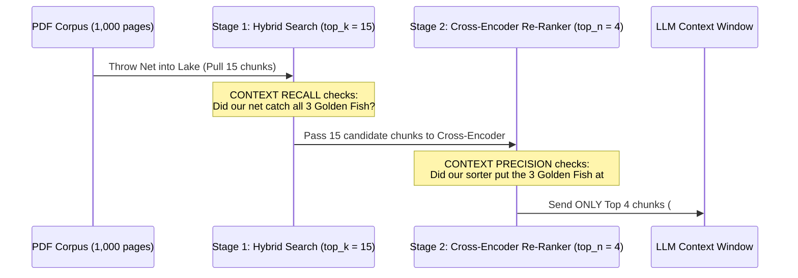

# 🎯 AI Engineering Interview Revision Guide: Invariable Docs
*Your high-signal, real-world revision companion for RAG, Hybrid Search, Embeddings, Re-Rankers, and Evaluation.*

---

## 1. Architectural Philosophy: Why "Plug-and-Play"?

### The Core Interview Concept
In system design interviews, never propose a hard-coded vendor integration (`e.g., calling OpenAI directly inside your business logic`). Modern AI engineering requires **Strict Separation of Concerns** via **Abstract Protocols (`Strategy Pattern`)**.



* **Why it matters:** If you run `Invariable Docs` on your local **MacBook Air M5 (16GB RAM)** using `Ollama` + `BGE-Large (MPS)` + `Qdrant Local`, and tomorrow your CTO says *"We need to deploy to enterprise AWS with OpenAI and Pinecone,"* **you do not touch a single line of your pipeline code.** You change three lines in `.env`, and the `ProviderFactory` swaps the engine automatically.

---

## 2. The Ingestion Flow Demystified (The "3 D's" & Node Walkthrough)

### The Mermaid Flowchart


> [!NOTE]
> **Why does `D` appear twice (`D --> E` and `D --> F`)?**  
> In Mermaid syntax, `D` (`Chunks of ~512 tokens`) is a single node variable. Because we send every chunk down **two parallel pipelines simultaneously** (one for semantic dense vectors (`E`), one for exact keyword BM25 indexing (`F`)), the node `D` branches in two directions at the same time!

---

### Real-World Walkthrough (`apple_10k_2023.pdf`, Page 42)

Imagine we have this exact paragraph from Apple's annual filing:
> *"Total R&D expenses in fiscal year 2023 were $29.9 billion, compared to $26.3 billion in 2022. This increase was primarily driven by headcount growth and silicon investments."*

Here is what happens to that exact text at every single node:

| Node | What It Represents | Exact Data State in Memory |
| :--- | :--- | :--- |
| **`A [Raw PDF]`** | Binary document file | `apple_10k_2023.pdf` (Raw PDF bytes on disk) |
| **`B [Text + Page Numbers]`** | Output of `PyMuPDF` extraction | Raw text string $+$ `page_no = 42` |
| **`C [Cleaned Text + Header]`** | Normalized text $+$ metadata | `{ "text": "Total R&D...", "doc_id": "apple_10k_2023.pdf", "page_no": 42, "section": "Item 7. Financial Discussion" }` |
| **`D [Chunks of ~512 tokens]`** | Split paragraph (`Chunk #42`) | **Pure English string:** *"Total R&D expenses in fiscal year 2023 were $29.9 billion..."* |
| **`E [Dense Vector]`** | Semantic embedding (`BGE-Large`) | `[0.12, -0.04, 0.88, 0.01, -0.32, ...]` *(1,024 floating-point numbers)* |
| **`F [Sparse Keyword Index]`** | BM25 word frequencies | `{ "R&D": 3.2, "expenses": 1.1, "2023": 2.4, "$29.9": 4.8, "billion": 0.9 }` |
| **`G [(Indexed Database)]`** | Qdrant / Pinecone point record | **Stored together:** (`E` Dense Vector $+$ `F` Sparse Keywords $+$ `D` Original English Text & Metadata) |

---

## 3. Anatomy of a Vector Database Record (`Why D is stored with E & F`)

### The Interview Gotcha Question
> *"If we convert English text (`D`) into a 1024-dimensional dense vector (`E`) and search using cosine distance... why do we still need to store the original English text (`D`) in the database?"*

### The Answer
If you only stored the vector numbers `[0.12, -0.04, 0.88, ...]`, when Qdrant finds the top matching record (#42), **you would have nothing to give the LLM!** An LLM (`Llama 3.1` or `GPT-4o`) **cannot read or reconstruct English sentences from floating-point mathematical arrays.**

Therefore, every modern vector database requires each stored record (`Point`) to contain three mandatory components:

```json
{
  "point_id": "chunk_0042",
  
  "dense_vector": [0.12, -0.04, 0.88, 0.01, -0.32, ...], 
  "sparse_vector": { "indices": [104, 882], "values": [3.2, 4.8] },
  
  "payload": {
    "text": "Total R&D expenses in fiscal year 2023 were $29.9 billion...",
    "metadata": {
      "doc_id": "apple_10k_2023.pdf",
      "page_no": 42,
      "section_header": "Item 7. Financial Discussion"
    }
  }
}
```

* **The Numbers (`dense_vector` + `sparse_vector`)** are used **only by the database engine internally** during the search step to calculate mathematical similarity.
* **The Payload (`payload.text` + `payload.metadata`)** is what the database **returns to your Python application** after finding the match, so you can inject the clean English text into the `<context>` XML tags for the LLM and show exact citations (`[Source: apple_10k_2023.pdf, p. 42]`) to the user!

---

## 4. Why Hybrid Search? (Dense vs. Sparse + RRF)

Why not just use Dense Embeddings alone? Why do we combine Cosine Similarity $+$ BM25 Keywords using **Reciprocal Rank Fusion (RRF)**?

| Search Type | How It Works | Superpower | Fatal Weakness |
| :--- | :--- | :--- | :--- |
| **Dense Search (Embeddings)** | Cosine angle between 1024-dim vectors | **Semantic Meaning:** Finds *"revenue expansion"* when query asks for *"sales growth"* | Fails on **Exact Matches:** Misses specific entity names, acronyms (`"EBITDA-CAPEX"`), and precise dollar numbers (`"$29.9 billion"`). |
| **Sparse Search (BM25)** | Term-frequency / length normalization | **Exact Precision:** 100% instant match when searching for specific codes (`"Section 14(a)"`) or numbers (`"$29.9B"`). | Fails on **Synonyms:** If query says *"automobile"* and document says *"car"*, BM25 scores it zero. |
| **Hybrid Search (RRF)** | $RRF\_Score = \sum \frac{1}{60 + rank}$ | **Best of Both Worlds:** Combines dense semantic understanding with exact sparse precision. Outperforms either individual method by 5–15%. | Requires running two search queries per prompt and tuning weights ($W_{dense}=0.7, W_{sparse}=0.3$). |

---

## 5. Precision vs. Recall (The "Golden Fish" Analogy)

In two-stage RAG retrieval (`Stage 1: Top 15 Hybrid Search` $\rightarrow$ `Stage 2: Top 4 Cross-Encoder Re-Ranker`), **Context Recall** and **Context Precision** measure two completely different failure modes.

Think of your PDF as a giant lake, and there are **3 Golden Fish** inside it (the exact 3 chunks that answer the user's question).



---

### Comparison: Recall Failure vs. Precision Failure

| Metric & Analogy | What It Checks (`RAGAS Score`) | When It Fails (`Score < 0.70`) | Root Cause & Debugging Action |
| :--- | :--- | :--- | :--- |
| **Context Recall**<br>*(Did the net catch the golden fish?)* | Did our first-stage search (`top_k = 15`) successfully pull all 3 golden answer chunks out of the entire database? | **Retrieval Miss!**<br>The info **existed in the PDF**, but our net pulled up 15 random chunks and left all 3 golden fish behind in the lake. | **First-Stage Engine Failure:**<br>Your embedding model (`BGE-Large`) or BM25 keywords missed the connection. *Fix by adjusting `chunk_size`, tuning BM25 $k_1$, or adding query transformations (Multi-Query / HyDE).* |
| **Context Precision**<br>*(Are the golden fish at the top of the bucket?)* | Did our second-stage re-ranker sort the 15 candidate chunks so the 3 golden fish sit right at the top (`#1, #2, #3`)? | **Re-Ranker Failure!**<br>The 3 golden fish **were indeed inside our bucket of 15** (`Recall = 100%`), but the re-ranker graded poorly and left them down at **`#12, #13, #14`** while sending `#1, #2, #3, #4` noise to the LLM! | **Second-Stage Engine Failure:**<br>Your cross-encoder (`BGE-Reranker-v2`) or threshold (`0.25`) misjudged relevance. *Fix by switching cross-encoder models (`Cohere Rerank v3.5`), increasing `top_n`, or tuning the relevance score cut-off.* |

---

## 6. Rapid-Fire Interview Questions & High-Signal Answers

#### Q1: Why do we use two stages (`Search Top 15` $\rightarrow$ `Re-Rank Top 4`) instead of just running the Cross-Encoder Re-Ranker on all 100,000 chunks directly?
> **Answer:** **Computational Complexity.**  
> Dense/Sparse embeddings are **Bi-Encoders**: you embed document chunks *once* offline ($O(1)$ at search time using HNSW graph indices).  
> Cross-Encoders are **Re-Rankers**: they process `(Query + Chunk)` together through all attention layers of a Transformer ($O(N)$ real-time compute). Running a cross-encoder on 100,000 chunks takes minutes and gigabytes of VRAM. We use fast HNSW bi-encoders to narrow 100,000 down to `15` (`Stage 1`), then use the heavy cross-encoder to precisely sort those `15` down to `4` (`Stage 2`).

#### Q2: What is the most common silent failure mode in RAG systems?
> **Answer:** **Chunking Strategy.**  
> If chunks are too small (`< 128 tokens`), they lose surrounding context (*"He signed the contract"* — who is 'he'?). If chunks are too large (`> 2048 tokens`), retrieval becomes noisy and the LLM suffers from the **"Lost in the Middle"** phenomenon where it ignores facts buried in the center of long context windows.

#### Q3: How do you prevent an LLM from hallucinating answers when the PDF doesn't contain the information?
> **Answer:** **Prompt Engineering $+$ Abstention Thresholds.**  
> 1. We wrap retrieved text in `<context>` XML tags and explicitly instruct the LLM: *"If the provided context does not contain sufficient information to answer truthfully, respond exactly: 'The provided documents do not contain information about this topic.' Do NOT guess or use prior knowledge."*  
> 2. We enforce a **Re-Ranker Score Cut-Off (`score_threshold = 0.25`)**. If even the #1 retrieved chunk scores below 0.25, our backend intercepts the request and returns the abstention message *before* calling the LLM, saving token budget!

#### Q4: What is RAGAS and how does it prevent regressions in CI/CD?
> **Answer:** **Retrieval-Augmented Generation Assessment (RAGAS)** is an evaluation harness that calculates four independent mathematical metrics over a curated **Golden Dataset** of ground-truth `(question, answer, context)` triples:
> * **Faithfulness (`> 0.85`):** Checks if every claim generated by the LLM is directly entailed by the retrieved chunks.
> * **Answer Relevancy (`> 0.80`):** Checks if the answer directly addresses the prompt without being evasive.
> * **Context Precision (`> 0.75`):** Checks if true answer chunks were ranked at the top (`#1-#4`).
> * **Context Recall (`> 0.70`):** Checks if true answer chunks were successfully retrieved (`#1-#15`).  
> We wire this harness into GitHub Actions pre-merge gates (`python -m invariable_docs.eval.regression_runner`). If an engineer changes a prompt or chunk size and any metric drops below threshold, the pull request is blocked.
