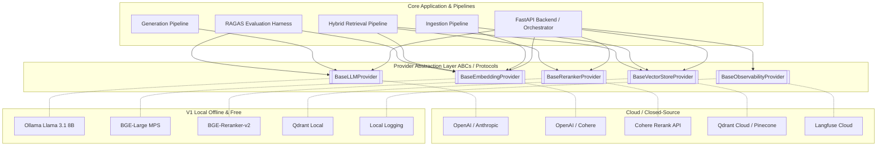

# 🏛️ Invariable Docs
### Enterprise-Grade Hybrid-Search RAG Knowledge Assistant

**Invariable Docs** is a high-precision document Q&A system engineered with a strict **Plug-and-Play Provider Architecture**. 

Version 1 runs **100% locally with zero API cost** on Apple Silicon (`MacBook Air M5 16GB RAM`), combining dense semantic embeddings with BM25 sparse keyword retrieval (`Reciprocal Rank Fusion`), second-stage cross-encoder re-ranking, cited response generation (`[Source: doc_id, p. X]`), and a built-in **RAGAS Evaluation Harness** wired directly into CI/CD.

---

## ✨ Key Capabilities

1. **Local-First M5 Optimization (16GB RAM Budgeted)**: Runs `Llama 3.1 8B` via **Ollama (Metal)**, `BGE-Large-v1.5` embeddings via **Apple MPS**, and `BGE-Reranker-v2` cross-encoders simultaneously without swap thrashing.
2. **Strategy/Protocol Provider Abstraction**: Switch from V1 Local (Ollama/Qdrant Local) to Enterprise Cloud (`OpenAI`, `Anthropic`, `Cohere`, `Pinecone`, `Langfuse Cloud`) by changing a single `.env` variable—requiring zero code modifications.
3. **Advanced Hybrid Retrieval Engine**:
   * **Dense Search**: Cosine similarity over normalized `1024-dim` vectors.
   * **Sparse Search**: `rank_bm25` keyword matching with length-normalization tuning ($k_1=1.2, b=0.75$).
   * **Reciprocal Rank Fusion (RRF)**: Combines ranked lists ($k=60$) with tunable dense/sparse weights ($0.7 / 0.3$).
   * **Second-Stage Re-Ranking**: Cross-encoder re-ranking filtering out low-relevance candidates before they enter the LLM context window.
4. **Grounded Generation & Anti-Hallucination**:
   * XML context injection with exact page/section metadata.
   * Strict citation enforcement and explicit abstention ("I don't know" threshold).
5. **Continuous RAGAS Evaluation Harness**:
   * Calculates **Faithfulness**, **Answer Relevancy**, **Context Precision**, and **Context Recall** over a curated golden dataset.
   * Regression runner blocks prompt or chunking parameter adjustments that degrade score thresholds.

---

## 🏗️ System Architecture & Plug-and-Play Providers



---

## 📂 Repository Structure

```text
invariable_docs/
├── src/
│   └── invariable_docs/
│       ├── config.py                 # Pydantic Settings (.env configuration engine)
│       ├── providers/                # Protocol interfaces & Provider Factory
│       │   ├── base.py               # Abstract provider definitions
│       │   ├── factory.py            # Dynamic provider instantiation
│       │   ├── llm/                  # Ollama, OpenAI, Anthropic implementations
│       │   ├── embeddings/           # Local MPS/BGE, OpenAI implementations
│       │   ├── rerankers/            # Local cross-encoder, Cohere implementations
│       │   └── vector_stores/        # Qdrant Local/Cloud, Chroma implementations
│       ├── ingestion/                # PyMuPDF/pdfplumber parsers & chunking strategies
│       ├── retrieval/                # BM25 index, query transforms, hybrid RRF engine
│       ├── generation/               # Grounded system prompts & citation verification
│       ├── eval/                     # Golden dataset & RAGAS regression harness
│       └── api/                      # FastAPI REST endpoints (/ingest, /query, /eval)
├── ui/
│   └── streamlit_app.py              # Interactive Web UI (Querying, Citation Inspection, Eval Dashboard)
├── tests/
│   ├── unit/                         # Unit tests for chunking, BM25, and prompt formatters
│   └── integration/                  # End-to-end pipeline verification tests
├── data/                             # Raw source PDFs/docs for ingestion
├── eval_results/                     # Historical RAGAS evaluation JSON logs
├── .env.example                      # Sample configuration settings
└── pyproject.toml                    # Python dependencies & build targets
```

---

## 🚀 Quickstart (Local V1 Mode)

### 1. Prerequisites
* **macOS (Apple Silicon M-series)** with `python >= 3.10`
* [Ollama](https://ollama.com/) installed locally running `llama3.1:8b-instruct-q4_K_M`

```bash
# Pull the required local model via Ollama
ollama pull llama3.1:8b-instruct-q4_K_M
```

### 2. Setup Environment & Dependencies
```bash
# Clone the repository and navigate into the folder
git clone https://github.com/yourusername/invariable_docs.git
cd invariable_docs

# Create and activate a Python virtual environment
python3 -m venv .venv
source .venv/bin/activate

# Install package in editable mode with development tools
pip install -e ".[dev]"

# Copy the configuration template
cp .env.example .env
```

### 3. Run the Backend API & Streamlit Dashboard
```bash
# Terminal 1: Launch FastAPI Backend
uvicorn invariable_docs.api.app:app --reload --port 8000

# Terminal 2: Launch Streamlit UI Dashboard
streamlit run ui/streamlit_app.py
```

### 4. Run the RAGAS Regression Evaluation Harness
```bash
python -m invariable_docs.eval.regression_runner --run-name initial_v1_baseline
```

---

## ⚖️ License
This project is licensed under the MIT License. See `LICENSE` for details.
